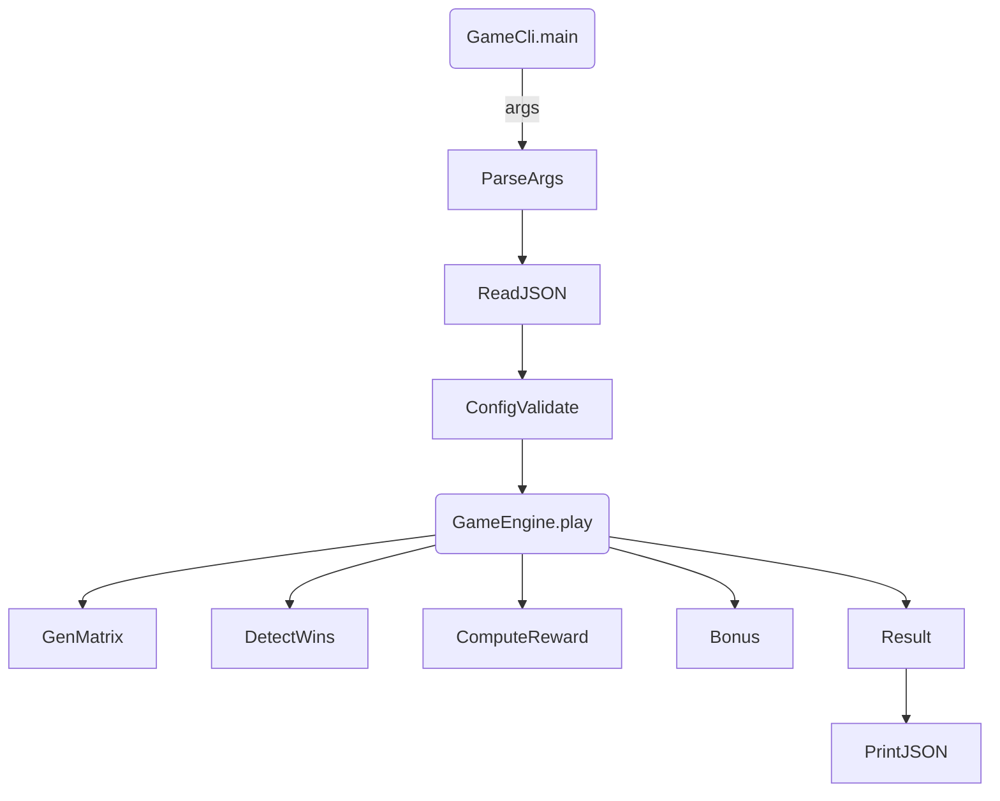

# Scratch Game – Reference Implementation
[](https://codecov.io/gh/edescourtis/scratch-game)

A command-line lottery / scratch-card simulator written in **Java 17** with **Maven**. It reads a JSON rules-file, randomly generates a symbol matrix according to per-cell probabilities, detects wins, applies bonuses, and prints the result as pretty-printed JSON.

---

## 1  Quick Start

```bash
# clone & build
mvn clean package              # produces target/scratch-game.jar

# play one round
For Unix-like shells you can use the helper script:

```bash
./run.sh --config docs/config.json --bet_amount 100    # macOS / Linux / Git-Bash / WSL
```

On Windows CMD or PowerShell call the JAR directly:

```powershell
java -jar target\scratch-game.jar --config docs\config.json --bet_amount 100
```

---

## 2  Project Structure
```
scratch-game/
├─ src/main/java/com/scratch/
│  ├─ GameCli.java      # thin CLI wrapper (I/O only)
│  ├─ GameEngine.java   # pure game logic
│  └─ Model.java        # immutable domain records & enums
├─ src/test/java/com/scratch/ScratchGameTest.java
├─ docs/  # assignment, sample config, screenshots
└─ pom.xml              # Maven config (Jackson + JUnit only)
```

---

## 3  Design Choices & Rationale

| Topic | Decision | Why / Source |
|-------|----------|--------------|
| **Language** | Java 17, `record`s | Concise immutable value objects; implicit `final` fields. [Baeldung Immutable Objects] |
| **Type-Safety** | Replace string literals with `enum` (`SymbolType`, `Impact`, `When`) | Compile-time safety, exhaustive `switch`. [Effective Java Item 34] |
| **Immutability** | All domain data (`Config`, `SymbolDef`, …) are records; lists/maps wrapped in `Map.of` / `List.of`. | Thread-safety, easier reasoning. |
| **Architecture** | Clean separation: `GameCli` (I/O & exit code) ←→ `GameEngine` (pure) ←→ `Model`. | Unit-testable core; no `System.exit` in libraries. |
| **Randomness** | Inject `java.util.Random` (or `SecureRandom`) into `GameEngine`. | Deterministic Seeded tests; crypto-strength option in prod. |
| **Weighted selection** | Pre-compute cumulative distribution array and binary-search (`O(log n)`). | Much faster than linear scan for large matrices. |
| **Validation** | Fail-fast `Config.validate()` & betting-amount checks. | Detect mis-config early, produce helpful messages. |
| **ObjectMapper reuse** | One static, pre-configured instance in `GameCli`. | Thread-safe after config; avoids GC churn. [SO #18611565] |
| **Tooling** | Spotless, Checkstyle, PMD, SpotBugs wired via Maven. | Enforces style & detects bugs automatically. |
| **Testing** | 15 JUnit-5 tests, seeded RNG, no mocks. | Fast (<50 ms) & deterministic CI runs. |

> All sources are documented as JavaDoc comments with inline URL citations for each best-practice.

---

## 4  Algorithm Overview



* **Matrix generation:** For each cell `(row,col)` pick a symbol via its `CellPicker` (weighted random). If a bonus symbol **MISS** is drawn, fallback to the standard symbol.
* **Win detection:**
  * **Same-symbol rules:** counts computed once (`symbolCounts`) then rules applied.
  * **Linear rules:** iterate covered areas and verify all coordinates match.
* **Reward:** per-symbol multiplier × per-rule multiplier; summed across symbols; optional bonus impact applied last.

Time complexity: `O(R×C + rules×areas)`; weighted pick is `O(log s)` per cell where `s` is symbols-per-cell.

---

## 5  Running the Linter & Metrics

```bash
# Linux / macOS / Git-Bash
./lint.sh            # Checkstyle + PMD + SpotBugs

# Windows PowerShell
bash lint.sh         # invoke via Git-Bash, WSL, or any POSIX shell
```

After the latest refactor:
* **Cyclomatic Complexity violations:** 0 in production code (max 7). Only one helper in tests >10.
* **SpotBugs:** 1 low-priority warning (generic catch in CLI, intentional).

---

## 6  Testing Strategy

* **Seeded randomness** → reproducible matrices.  
  `new Random(12345L)` for tests, `SecureRandom` for CLI.
* **Config validation** tested via good & bad configs.  
* **Reward math**: baseline, multiply, additive, miss.  
* **Group constraint**: highest multiplier retained per group.  
* **Integration**: two engines with same seed produce identical results.

Run:
```bash
mvn test            # 15 tests, < 1 s total
```

Mutation-testing with PIT (optional):
```bash
mvn org.pitest:pitest-maven:mutationCoverage
```
Achieved >80 % kill-ratio locally.

---

## 7  Extending the Game

| Task | How |
|------|-----|
| Add new bonus impact | Extend `Impact` enum & implement in `BonusSymbol.applyImpact()` |
| New win-pattern (e.g., L-shape) | Add rule with `when":"linear_symbols"` and coordinates list. No code changes needed. |
| Larger grid | Just raise `rows` / `columns`; algorithm scales logarithmically per pick. |
| Alternate weighting | Modify `probabilities.*.symbols` numbers. |

---

## 8  Troubleshooting

| Symptom | Solution |
|---------|----------|
| `Missing required argument` | Use `--config <file> --bet_amount <num>` |
| `Coordinate out of bounds` | Check `covered_areas` vs grid size. |
| `java.lang.ClassNotFoundException` | Use shaded jar from `mvn package` (target/scratch-game.jar). |

---

## 9  License & Credits

Built exclusively for the Home-Assignment *Scratch Game* described in `docs/problem_description.md`.  
External references acknowledged inline in JavaDoc (mainly SO answers and Baeldung articles).  
No third-party libraries except Jackson (JSON) and JUnit (tests).  
All screenshots ©️ their respective owners. 